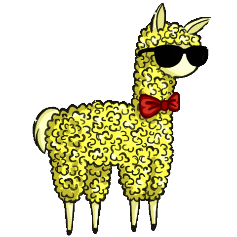

## What a Wonderful Day for Scala

We're going to learn:
- Classes in Scala
- Case Classes
- Companion/Singleton Objects

---

## You've been hired!


Note: You've been hired by *The Llama Shaving Co*
- Your boss has told you to create a Llama shaving simulator. You were once a lowly Java programmer, but he wants you to do it in *Scala!*. He wants it to be functional. Let's give it a shot.
- As an OO programmer the first thing that comes to your mind is to build a class...and try to make it functional.

---

You've been asked to...

---

Create a concept of a llama

---

It should store it's fluffyness somehow
  
---

It should be able to be shaved, reducing it's fluffyness

---

## Whiteboarding Time

---

Basic class in Scala:
```scala
class Llama {


}
```

Note: This is all it takes to make a class in Scala. It doesn't do much.
- Haha wow this Scala thing is easy right...hahahaha
We need to measure fluffyness somehow!

---

Creating an instance of the class (an object):
```scala
val bananaLlama = new Llama()
```

---

Adding a field to a class:
```scala
class Llama(fluffyness: Int) {


}
```

Note: 
This will do a few things:
- Add this as a required value to the class constructor
- Save this as an immutable, private value within the class.
This is cool because it's so much less verbose than java!

---

Creating an instance with a field:
```scala
val pajamaLlama = new Llama(1)

// ...
```

---

Accessing a field:
```scala
val pajamaLlama = new Llama(1)
println(pajamaLlama.fluffyness)
// Prints "1"
```

---

Actually, that wouldn't work. Fluffyness was declared as a private value.

---

Declaring as a val allows us to access it outside of the class.
```scala
class Llama(val fluffyness: Int) {
  
 
    
  
}
```

---

Now this will actually work:
```scala
val pajamaLlama = new Llama(1)
println(pajamaLlama.fluffyness)
// Prints "1"
```

---

Adding a method definition:
```scala
class Llama(val fluffyness: Int) {
  
  def shave(woolAmt: Int): Unit = {
    // Note that Unit means "Nothing"  
  }
}
```

Note: 
Now, let's add some logic to that method. Otherwise it doesn't do anything!
As the clueless OO programmer you are, you might write something verbose like this:

---

Adding some logic:
```scala
class Llama(val fluffyness: Int) {
  
  def shave(woolAmt: Int): Unit = {
    fluffyness = fluffyness - woolAmt
  }
}
```

---

Wait...that didn't work!

---

That's because fluffyness is immutable!

---

Scala does this to ~~make your life hard~~ keep things functional.
 > All variables are immutable in FP

Note: Ask me this question at the end if we get time!

---

Now it returns a Llama:
```scala
class Llama(val fluffyness: Int) {
  
  def shave(woolAmt: Int): Llama = {

  }
}
```
Note: This is a common pattern. So Scala has some nice syntactic sugar for doing this.

---

Let's do that the long way:
```scala
class Llama(val fluffyness: Int) {
  
  def shave(woolAmt: Int): Llama = {
    return new Llama(fluffyness - woolAmt)
  }
}
```
Note: This is a common pattern. So Scala has some nice syntactic sugar for doing this.

---

We don't need `return`
```scala
class Llama(val fluffyness: Int) {

  def shave(woolAmt: Int): Llama = {
    new Llama(fluffyness - woolAmt)
  }
}
```

---

We don't need `{}`
```scala
class Llama(val fluffyness: Int) {

  def shave(woolAmt: Int): Llama =
    new Llama(fluffyness - woolAmt)

}
```

Note: Lot's more syntactic sugar to come.
Okay let's go print this out and check everything works.
- You can see Scala is slightly shorter, but not all that much at the moment.

---

Using a method:
```scala
val dramaLlama = new Llama(5)
val shavedLlama = dramaLlama.shave(3)
println(shavedLlama.fluffyness)
// Prints 2
```

---

Let's recap so far:
 - We made a class with a field and method
  + A class is a schematic to create instances of itself
 - We've seen some basic syntax
 - Scala kept things functional
 
---

Onto the next step...

---

## Mergers & Aquisitions
We have succeeded in our hostile takeover of *Llama Transport Co* in the Andes.

Note: Llamas are now sent on perilous journeys through the Andes. We need to track if they keep their fluffyness and strength!
- We are also more humane for better PR, and have given our llamas names.

---

You've been asked you to...

---

Add more fields:
- Update the `llama` class with `strength` and `name`

---

Copy objects:
- Create a copy of a `llama` before they leave

---

Check for equality:
- Ensure they are the same as their copy when they come back.

---

This is so we know the llamas haven't lost fluffyness or strength over their long and perilous journey!

---

Update our fields:
```scala
class Llama(fluffyness: Int, strength: Int, name: String) {

  def shave(woolAmt: Int): Llama =
    new Llama(fluffyness - woolAmt)

}
```

> `val` has been dropped for now, we'll see why later.

---

Define copying and equality the long way:

```scala
class Llama(fluffyness: Int, strength: Int, name: String) extends Cloneable {
  
  def shave(woolAmt: Int): Llama =
    new Llama(fluffyness - woolAmt)

  def equals(other: Llama): Bool = {
    // Define what two llamas being equal means.
  }
  
  def clone(other: Llama): Llama = {
    // Define how to copy a llama.
  }
}
```

---

Define copying and equality:
```scala
case class Llama(fluffyness: Int, strength: Int, name: String) {

  def shave(woolAmt: Int): Llama =
      new Llama(fluffyness - woolAmt)

}
```

---

Cool. What is a case class?

---

It's just a package for data.
- You could think of it as:
  - A struct
  - JSON

---

It gives you stuff you might want for data:
  + Syntactic sugar
  + Equality
  + Copying
  + HashCode
  + toString
  + Serialisable
  + Pattern matching
  + Algebraic Data Types
  + Automatically defined getters and setters
  
---

> Drawback of Case Class

Your compiled code is a little larger due to implementing all this. The program will also take longer to compile.

---

How do we use case classes?

---

Creating a case class:
```scala
val alabamaLlama = Llama(5, 5, "Benny")


// `new` keyword not needed.
```

---

Create a copy:
```scala
val alabamaLlama = Llama(5, 5, "Benny")
val copyLlama = alabamaLlama.copy()


// copy is automatically implmented for us
```

---

Check equality:
```scala
val alabamaLlama = Llama(5, 5, "Benny")
val copyLlama = alabamaLlama.copy()

println(alabamaLlama == copyLlama)
// prints true
```

---

In summary:
Why do we have case classes?

---

Good for storing data.
+ We indicate to people reading the code that it's data type
+ We get a lot of things for free
  
---

For example, we can wrap an int with a miles or kilometres case class:
- We get equality for free, like we would with an int
- Our space probes wont crash

---

Recap:

- We've added more fields
- We've turned Llama into case class, which has given us a variety of benefits

---

Moving on...

---

## Llama Requests

---

You've been asked to...

---

Create a new Llama object from a string

---

Such as: "I want a Llama with strength 3 and fluffyness 1"

---

Let's build a constructor that makes a Llama from a string

---

You may think to use an auxillary constructor:
```scala
val fatherLlama =
  Llama("I want a Llama with strength 3 and fluffyness 1")
```

---

In our case class:

```scala
case class Llama(fluffyness: Int, strength: Int, name: String) {

 


  
  
  // shave definition...
}
```

---

Define an auxillary constructor:
```scala
case class Llama(fluffyness: Int, strength: Int, name: String) {

  def this(request: String) = {

   


  }
  
  // shave definition...
}
```

---

Add logic:
```scala
case class Llama(fluffyness: Int, strength: Int, name: String) {

  def this(request: String) = {
     
    // Logic to turn string into fluffyness, strength and name


  }
  
  // shave definition...
}
```

---

Invoke the primary constructor:
```scala
case class Llama(fluffyness: Int, strength: Int, name: String) {

  def this(request: String) = {
     
    // Logic to turn string into fluffyness, strength and name

    
    this(requestedFluffyness, requestedStrength, randomName)
  }
  
  // shave definition...
}
```

---

This won't work. Why?

---

Auxillary constructors need to invoke the primary constructor or another auxillary constructor in the first  line.

---

This is so all auxillary constructors eventually invoke the primary constructor, making it the single point of entry to create the class.

---

It's a little vague as to why it's in the first line, but:
- It's because Java does it
- It's so we can't access fields that don't exist yet.

---

It's possible to get around this restriction, but clunky.

---

Instead, let's make a function as our constructor

---

Declare fuction:
```scala
def createLlamaFromRequest(request: String): Llama = {


  // Notice how we can name this function whatever we want.


}
```

---

Pattern Match:
```scala
def createLlamaFromRequest(request: String): Llama = {

  request match {

  
  
  
  

  }

}
```

---

Pattern Match:
```scala
def createLlamaFromRequest(request: String): Llama = {

  request match {
    case "I want a Llama with strength 3 and fluffyness 1"
   
   
   
   

  }

}
```

---

Pattern Match:
```scala
def createLlamaFromRequest(request: String): Llama = {

  request match {
    case "I want a Llama with strength 3 and fluffyness 1" =>
      Llama(1, 3, "Parma")
    
    
    

  }

}
```

---

Pattern Match:
```scala
def createLlamaFromRequest(request: String): Llama = {

  request match {
    case "I want a Llama with strength 3 and fluffyness 1" =>
      Llama(1, 3, "Parma")
    case "Give me a Llama with strength 5 and fluffyness 5" =>
      Llama(5 ,5, "Lava")
    

  }

}
```

---

And so on:
```scala
def createLlamaFromRequest(request: String): Llama = {

  request match {
    case "I want a Llama with strength 3 and fluffyness 1" =>
      Llama(1, 3, "Parma")
    case "Give me a Llama with strength 5 and fluffyness 5" =>
      Llama(5 ,5, "Lava")
    //...

  }
   
}
```

---

What happens if there is no match?
```scala
def createLlamaFromRequest(request: String): Llama = {

  request match {
    case "I want a Llama with strength 3 and fluffyness 1" =>
      Llama(1, 3, "Parma")
    case "Give me a Llama with strength 5 and fluffyness 5" =>
      Llama(5 ,5, "Lava")
    //...
    case _ => // ???
  }
   
}
```

---

With `Option`:
```scala
def createLlamaFromRequest(request: String): Option[Llama] = {

  request match {
    case "I want a Llama with strength 3 and fluffyness 1" =>
      Llama(1, 3, "Parma")
    case "Give me a Llama with strength 5 and fluffyness 5" =>
      Llama(5 ,5, "Lava")
    //...
    case _ => // ???
  }
   
}
```

---

Return `None`:
```scala
def createLlamaFromRequest(request: String): Option[Llama] = {

  request match {
    case "I want a Llama with strength 3 and fluffyness 1" =>
      Llama(1, 3, "Parma")
    case "Give me a Llama with strength 5 and fluffyness 5" =>
      Llama(5 ,5, "Lava")
    //...
    case _ => None
  }
   
}
```

---

Wrap with `Some`:
```scala
def createLlamaFromRequest(request: String): Option[Llama] = {

  request match {
    case "I want a Llama with strength 3 and fluffyness 1" =>
      Some(Llama(1, 3, "Parma"))
    case "Give me a Llama with strength 5 and fluffyness 5" =>
      Some(Llama(5 ,5, "Lava"))
    //...
    case _ => None
  }
   
}
```

---

Where does this function go?

---

## Objects

> Singleton Objects

---

## Whiteboarding Time

> Dalai Llama

---

Declaring an object:
```scala
object LlamaCreator {


}
```

---

Adding a method to an object:

```scala
object LlamaCreator {

  def createLlamaFromRequest(request: String): Option[Llama] = {
    request match {
      case "I want a Llama with strength 3 and fluffyness 1" =>
        Some(Llama(1, 3, "Parma"))
      case "Give me a Llama with strength 5 and fluffyness 5" =>
        Some(Llama(5 ,5, "Lava"))
      //...
      case _ => None
    }
  }
  
}
```

---

Let's use that object

---

Declare a value:
```scala
val wannaLlama: Option[Llama] =


//...
```

> `wannaLlama` may or may not exist

---

Calling an object:

```scala
val wannaLlama: Option[Llama] =
  LlamaCreator.createLlamaFromRequest(

  )
```

> `wannaLlama` may or may not exist

---

Calling an object:

```scala
val wannaLlama: Option[Llama] = 
  LlamaCreator.createLlamaFromRequest(
    "I want a Llama with strength 3 and fluffyness 1"
  )
```

> `wannaLlama` may or may not exist

---

Problem: `LlamaCreator` is rather separate from Llama right now. This can be confusing.

---

## Companion Objects

Note: Like singleton objects, but attached to a class of some kind.
- Just change the name of the object to be the same as the class.
- Whiteboard this up
  - There exists only one object, never 0, never more than 1.
  - They are lazy loaded, so technically they don't exist before then, actually.

---

A companion object:
 - Is in the same file as it's class
 - Has the same name as it's class
 - Can access private things in it's class

---

Let's see that in code

---

Next to our class:
```scala
case class Llama(fluffyness: Int, strength: Int, name: String) {
  // shave definition
}


 

 


  

// Real quiet down here...
```

---

Declare object with same name:
```scala
case class Llama(fluffyness: Int, strength: Int, name: String) {
  // shave definition
}

object Llama {

  
   
    
     
      
      
   

}
```

---

Add our method:
```scala
case class Llama(fluffyness: Int, strength: Int, name: String) {
  // shave definition
}

object Llama {

  def createLlamaFromRequest(request: String): Option[Llama] = {
    request match {
      case "I want a Llama with strength 3 and fluffyness 1" =>
        Some(Llama(1, 3, "Parma"))
      //...
      case _ => None
    }
  }
}
```

---

Calling it works the same:
```scala
val wannaLlama: Option[Llama] = 
  Llama.createLlamaFromRequest(
    "I want a Llama with strength 3 and fluffyness 1"
  )
```

---

Summary

---

Why do we have singleton objects?

- They provide a way to store "static" functions
 + A bag of functions
- Why not have static classes?
- What else?

---

Why do we have companion objects?

- Makes more sense to a human
- Can access private fields and methods
- Can put constructors in them
- What else?

---

Why have a constructor in a companion object?

- Can name it what we want
- More flexbility in what we return
- What else?

---

Now we're going to get a bit spicier.

---

## Monetising the Llamas further
We have taken on a contract from a french fashion company to advertise hats.

---

All llamas now have four types of Hats:
- Paris Hat
- Toulouse Hat
- Marseille Hat
- Nice Hat

---

Each hat requires a trick when a traveller sees them:
- Paris Hat => Sit
- Toulouse Hat => Shake
- Marseille Hat => Talk
- Nice Hat => Triple backflip

---

What your end result should like:
```
> println(hat.trick)
"Talk"
```

---

Let's think about this...

Note: Let's use ADT
- Let's think about this...
- The function needs to map each hat to a trick
- A hat can come in four different flavours, but each llama *always* has a hat.
- All llamas need to do tricks with their hat

---

All llamas *must* have hats, but a hat can come in four different flavours.

---

There are a few different ways of doing this.

---

Each Llama could store a string that describes the hat:
```scala
case class Llama (
  fluffyness: Int,
  strength: Int,
  name: String,
  hat: String
)
```

---

Why is that bad?

---

We could recieve any input, then...

> We would have a runtime error instead of a compile time error.

---

How do we get a compile time error? 
> Enumeration?

---

Some problems with Enumeration:

1. Enumerations have the same type after erasure.
2. There’s no exhaustive matching check during compile.
3. They don’t inter-operate with Java’s enum.

---

## Traits

Note: Like interfaces from Java.
- They are `extendable`
- They came with their own methods/fields and abstract methods if you want
- But they are done a little more functionally

---

Create a trait:
```scala
trait Hat


// ...
```

Note: Cool! We made a trait. Now lets do something with it.

---

We now have a hat type!
```scala
val hat: Hat = // ???
```

---

Extend the trait:
```scala
trait Hat

case object Paris extends Hat


// ...
```

---

Now we can define:
```scala
val hat: Hat = Paris
```

---

Extend the trait further:
```scala
trait Hat

case object Paris extends Hat
case object Toulouse extends Hat
case object Marseille extends Hat
case object Nice extends Hat
```

---

Now we can define:
```scala
val parisHat: Hat = Paris
val toulouseHat: Hat = Toulouse
val marseilleHat: Hat = Marseille
val niceHat: Hat = Nice
```

---

What is a case object?

---

All the same things case does to class, we do to object.

---

But it's a little less. We don't need stuff like copy or equality, as there is only ever one.

---

We want to pattern match.

---

Let's go back to our `Hat` trait:

Note: We have now added hat as a value to llama.

---

In the `Hat` trait:
```scala
trait Hat {

 
 
  
   
    
     
    
  
}
// case objects down here
```

---

We can define a function:
```scala
trait Hat {

  def trick: String = {
    
      
      
      
      
    
  }
}
// case objects down here
```

---

Pattern match:
```scala
trait Hat {

  def trick: String = {
    this match {
      
    
     
     
    }
  }
}
// case objects down here
```

---

Create a case:
```scala
trait Hat {

  def trick: String = {
    this match {
      case Paris => "Sit"
    
     
     
    }
  }
}
// case objects down here
```

---

Fill it in:
```scala
trait Hat {

  def trick: String = {
    this match {
      case Paris => "Sit"
      case Toulouse => "Shake"
      case Marseille => "Talk"
      case Nice => "Triple backflip"
    }
  }
}
// case objects down here
```

---

Shorter:
```scala
trait Hat {

  def trick: String = this match {
    case Paris => "Sit"
    case Toulouse => "Shake"
    case Marseille => "Talk"
    case Nice => "Triple backflip"
  }

    
}
// case objects down here
```

---

Now we can:
```scala
val parisHat: Hat = Paris
println(parisHat.trick)
// Prints "Sit"
```

---

Beware their are devious illegal hats out there!

---

In Illegal.scala
```scala
case object IllegalHat extends Hat
```

---

Now what happens?
```scala
val illegalHat: Hat = IllegalHat
println(illegalHat.trick)
// Oh no!
```

---

Use sealed!

---

Seal our trait:
```scala
sealed trait Hat {

  def trick: String = this match {
    case Paris => "Sit"
    case Toulouse => "Shake"
    case Marseille => "Talk"
    case Nice => "Triple backflip"
  }

    
}
// case objects down here
```

---

Now it can't be extended outside of this file!

---

We now have *exhaustive* pattern matching that will fail to compile if a case is removed!

Note: This means that no one can extend our trait outside of that file. It means the program is now confident that it has handled all possible cases of a hat in that pattern match.

---

Turns out advertising hats in Andes mountain trails wasn't a great idea.

Note: Our french company has pulled it's sponsorship. What do we do with all these hats!

---

We're pivoting to fruit hats.

Note: Llamas now carry fruit in their hats, for the llamas to eat.

---

```scala
sealed trait Hat {
  // trick defined here
}

case class Paris(numOfApples: Int) extends Hat
case class Toulouse(numOfApples: Int, numOfOranges: Int) extends Hat
case class Marseille(numofPizzas: Int) extends Hat
case object Nice extends Hat
```

---

```scala
sealed trait Hat {

  def eatHat: Hat = this match {
    case Paris(numOfApples) => Paris(numOfApples - 1)
    case Toulouse(numOfApples, numOfOranges) => Toulouse(numOfApples - 1, numOfOranges - 1)
    case marseille @ Marseille(_) => marseille
    case Nice => Paris(5)
  }

}
```

---

We're switching back to object orientated, that was too hard.

---

Questions!
